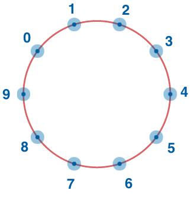

[Back](../README.md)

# Circle of Numbers

https://app.codesignal.com/arcade/intro/level-7/vExYvcGnFsEYSt8nQ

## Challenge description

Consider integer numbers from 0 to n - 1 written down along the circle in such a way that the distance between any two neighboring numbers is equal (note that 0 and n - 1 are neighboring, too).

Given n and firstNumber, find the number which is written in the radially opposite position to firstNumber.

##### Note: n is always a positive even integer!

## Example

For `n = 10` and `firstNumber = 2`, the output should be
`solution(n, firstNumber) = 7`.

## Solution

[Solved with Python 3](circle_of_numbers.py)
